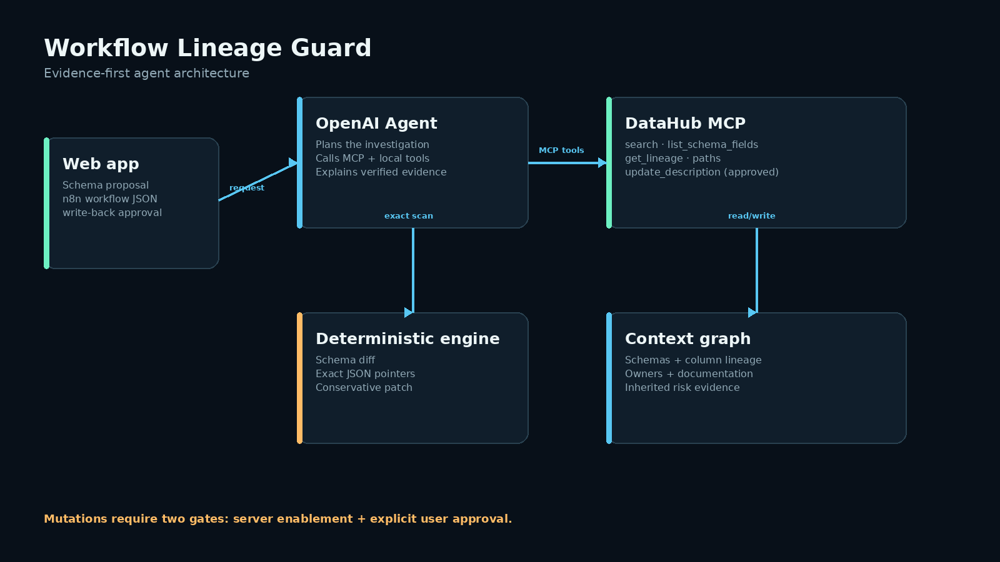

# Workflow Lineage Guard

**Predict what an upstream schema change will break, repair exact n8n references, and return the evidence to DataHub.**

[**Try the interactive browser demo →**](https://workflow-lineage-guard-demo.sweet-hake-1733.chatgpt.site)  
No credentials or installation required. The public demo runs the deterministic engine locally in your browser and does not claim live DataHub verification.

Workflow Lineage Guard is a DataHub-powered agent built for the **Agents That Do Real Work** category. It combines DataHub's context graph with deterministic JSON analysis so a language model can explain and orchestrate a repair without inventing the repair itself.

## Verification status

This repository is an early open-source release. Its local engine is verified; the credentialed
DataHub path is implemented but must not be described as live-verified until a real tenant run
produces the safe evidence file.

| Capability | Status |
| --- | --- |
| Deterministic schema and n8n analysis | Verified locally |
| Automated tests and lint | Test suite passing; Ruff clean |
| Offline web demo | Verified locally |
| Real DataHub MCP reads | Implemented; tenant proof not yet bundled |
| Approved DataHub write-back | Implemented behind two gates; not yet live-verified |
| Public browser demo | [Live and judge-accessible](https://workflow-lineage-guard-demo.sweet-hake-1733.chatgpt.site) |

## Why it matters

A field rename can be valid in a warehouse and still break a customer-facing automation hours later. Lineage Guard connects three pieces that usually live apart:

```text
DataHub schema + lineage  →  exact workflow references  →  safe patch + graph write-back
```

The app shows the affected node, exact JSON pointer, evidence-based risk, generated before/after patch, and a Markdown incident note for the affected DataHub dataset.

## Current capabilities

- Optional DataHub MCP connection for schema and lineage verification.
- Exact reference extraction for common n8n forms such as `$json.email`, `$json["email"]`, and node JSON expressions.
- Explicit and conservative inferred rename detection.
- Safe JSON mutation with full before/after evidence.
- `safe`, `needs_review`, and `blocked` deployment verdicts.
- Explicit approval boundary for DataHub mutation tools.
- Fully functional offline demo when credentials are missing.
- Downloadable fixed workflow and judge-ready sample outputs.

## Quick start — no credentials required

Prerequisites: Python 3.11+ and [uv](https://docs.astral.sh/uv/).

```bash
uv sync --extra dev
cp .env.example .env.local
uv run python main.py --demo --output examples/demo_report.json
uv run python main.py --serve
```

Open `http://localhost:8000`. Keep `OPENAI_API_KEY=replace_me` and `DATAHUB_MODE=demo` for the bundled offline scenario. The status badge will clearly show **Demo mode**.

You can also verify the deterministic engine without installing web dependencies:

```bash
python -m unittest discover -s tests -v
```

## Enable the live agent

Copy `.env.example` to the ignored `.env.local` and replace only the local values:

```dotenv
OPENAI_API_KEY=replace_me
OPENAI_MODEL=gpt-5-mini
DATAHUB_MODE=live
DATAHUB_MCP_URL=https://your-tenant.acryl.io/integrations/ai/mcp
DATAHUB_TOKEN=replace_me
DATAHUB_ENABLE_WRITEBACK=false
```

Set `OPENAI_API_KEY` and `DATAHUB_TOKEN` to real values locally. Never commit `.env.local`. The app fails gracefully to deterministic demo mode when either live connection is unavailable.

For write-back, mutation tools must be enabled on the DataHub MCP server and `DATAHUB_ENABLE_WRITEBACK=true`. The user must still check **Approve DataHub write-back** for the individual scan. Without both approvals, `update_description` is not exposed to the agent.

### Prove DataHub independently of the OpenAI key

The real DataHub connection can be verified before an OpenAI key is available. After setting
`DATAHUB_MCP_URL` and `DATAHUB_TOKEN` in `.env.local`, run:

```bash
uv run python scripts/datahub_preflight.py
```

This initializes the real MCP server, captures its advertised tool schemas, searches the real
catalog, reads one dataset's schema, and queries its downstream lineage. It writes a
credential-safe proof to `outputs/datahub-live-evidence.json`; the token is neither printed nor
saved.

To prove controlled graph write-back, first enable mutation tools in the DataHub instance, then
set `DATAHUB_ENABLE_WRITEBACK=true` and run:

```bash
uv run python scripts/datahub_preflight.py --writeback
```

The two gates are intentional. The command appends a timestamped verification marker with
`update_description`; it does not replace existing documentation. Use
`DATAHUB_TEST_DATASET_URN` when you want to control exactly which sample dataset is touched.

## Architecture



```text
Browser / API request
        │
        ├── deterministic engine
        │     ├── schema diff
        │     ├── n8n reference evidence
        │     └── conservative JSON patch
        │
        └── OpenAI Agents SDK (live mode)
              ├── DataHub MCP: search / schema / lineage
              ├── deterministic engine as a function tool
              └── approved update_description write-back
```

One agent is intentionally used. The deterministic tool owns correctness; the agent owns context retrieval, orchestration, and explanation.

The bundled lineage path is synthetic request data and is labeled that way in generated reports.
Only recorded MCP tool calls can set `provenance.datahub_verified` to `true`.

## API

- `GET /health` — readiness and non-secret runtime status.
- `GET /api/demo` — bundled synthetic input.
- `POST /api/analyze` — schema/workflow impact analysis.

Example request shape:

```json
{
  "dataset_urn": "urn:li:dataset:(urn:li:dataPlatform:snowflake,raw.customers,PROD)",
  "current_schema": {"customer_email": "string"},
  "proposed_schema": {"email_address": "string"},
  "rename_map": {"customer_email": "email_address"},
  "workflow": {"name": "Reminder", "nodes": []},
  "allow_writeback": false
}
```

## Safety behavior

- A removed referenced field with no replacement produces `blocked` and no automatic patch.
- A type change produces `needs_review` and no automatic coercion.
- An explicit rename can be patched, but the verdict remains `needs_review` until a human deploys it.
- Live MCP failures preserve deterministic evidence and return a visible warning.
- Secrets are read only from the environment; `.env.local` is ignored.

## Repository map

```text
agent.py                    OpenAI Agent + DataHub MCP orchestration
main.py                     FastAPI and CLI entry point
lineage_guard/engine.py     deterministic evidence and repair engine
static/                     responsive judge-facing interface
data/                       synthetic demo fixtures
examples/                   generated before/after artifacts
tests/                      core safety regression tests
docs/                       prompt, disclosure, and diagrams
.github/                    CI, issue forms, and pull-request checks
DEVPOST_SUBMISSION.md       application copy and checklist
```

## Open-source development

Workflow Lineage Guard is at `v0.1.0` and does not claim production adoption yet. The initial
release is designed to make the safety logic reproducible and invite review before broader
workflow support is added.

- See [CONTRIBUTING.md](CONTRIBUTING.md) for setup, tests, and contribution boundaries.
- See [ROADMAP.md](ROADMAP.md) for scoped follow-up work.
- Report security concerns using [SECURITY.md](SECURITY.md).
- Changes are tracked in [CHANGELOG.md](CHANGELOG.md).

## Hackathon compliance

- Newly built during the July 6–August 10, 2026 submission period.
- Uses the open-source DataHub platform with its official MCP Server.
- Public source intended under Apache License 2.0.
- Includes synthetic sample inputs/outputs and complete local instructions.
- AI coding assistance is disclosed in `docs/BUILD_DISCLOSURE.md`.

See [DEVPOST_SUBMISSION.md](DEVPOST_SUBMISSION.md) for the prepared application copy.

## License

Apache License 2.0. See `LICENSE`.
